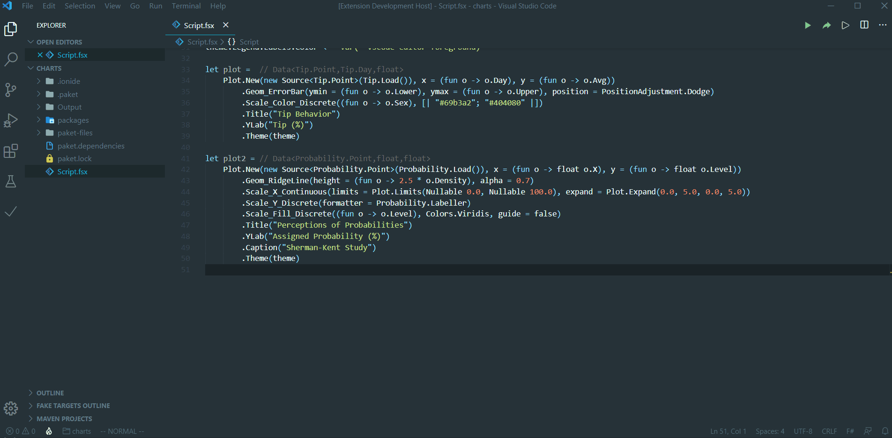

# fsharp-notebook README

fsharp-notebook is a lightweight visualization tool to assist during data exploration and prototyping. In combination with [ionide](https://ionide.io), VSCode becomes a very capable F# IDE for data science.

## Features

* Register "rich output" printers to FSI (i.e. fsi.addPrinter)
* Render [SVG plots](https://pablofrommars.github.io), HTML fragments, Markdown, text...
* Save HTML Notebooks

## Command Palette

* **F# Notebook: Open Panel**
* **F# Notebook: Save Panel**

## Settings

* **fsharpnotebook.css**: Specifies the path to your custom css style used for saving panel (Optional)